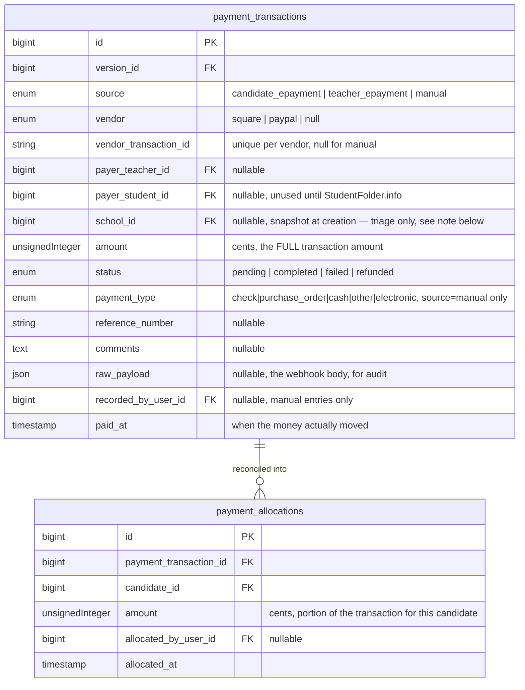

# Electronic Payments — Implementation Plan

Scoped 2026-08-14 from a direct product-owner request plus a clarifying-question pass (see §0 below). Not yet built — this is the plan for tomorrow's work, following this project's usual "design doc → implementation" split (see `event-version-orientation.md` for the precedent this doc borrows its section style from).

---

## 0. What was asked, and what was clarified

**The problem as stated:** Electronic payments are already accepted today, off-platform, via PayPal and Square buttons that send the payer to the vendor with enough information to create a payment record. The vendor is supposed to send a status message back, but that step has never worked — payments have always been reconciled by hand. The goal for this iteration is to remove that manual step: real webhook-driven status updates.

**Correction, 2026-08-14 (mid-implementation):** this doc originally said "Stripe" throughout, based on a product-owner mis-statement — the actual second vendor already in off-platform use, and the one with real sandbox credentials, is **Square**, not Stripe. Every "Stripe" reference below has been corrected to Square (package, checkout flow, webhook verification, event names — Square's API shape doesn't map 1:1 onto Stripe's, so this was a real content fix, not a find-and-replace). §2.2 now reflects Square's actual Checkout/Webhooks APIs, researched at correction time.

**Business rules, as given:**
- Event Managers decide, per Version: whether electronic payment is accepted at all, and if so, whether it's available to teachers, students, or both.
- If accepted for students, individual teachers still decide whether *their* students get to use it — some teachers (especially lower grades) prefer cash handed to them directly.
- Regardless of payment method, the teacher is responsible to the organization for their school's balance being settled: `(candidates with status=registered) × versions.*_fee`.
- **Candidate registration status is never gated by payment.** This plan makes no changes to `CandidateStatus`/the registration checklist.
- Payments arrive from three sources, previously modeled in different, incompatible tables: (1) candidate e-payments, identifiable by `candidate_id`; (2) teacher e-payments, which are frequently a single lump sum covering multiple candidates — reconciling that split to actual candidates has been "haphazard at best"; (3) manual entries (checks, POs) recorded by the Registration Manager.
- A standard reconciliation process at the school and Version level would be an improvement.

**Clarifying answers that shape this plan:**

| Question | Answer |
|---|---|
| Who clicks "pay" for a student's fee, given there's no student portal today? | Deferred — StudentFolder.info is a **separate, next-phase project** ("next week"), a whole new module. **This iteration builds no student-facing payment UI.** The `epayment_student` config flag and teacher opt-in are still built now, but have no consumer until that module exists. |
| Do real vendor sandbox credentials exist to build/test against? | Yes, for both. **Square first** (built and verified end-to-end against real sandbox credentials), **then PayPal**. |
| Can a teacher's group payment carry structured per-candidate metadata for auto-splitting? | No — **lump sum only**, matching the "haphazard" history. Reconciling a group payment to specific candidates is and will remain a **manual allocation step**, not something a webhook can do automatically. |
| Build one vendor or both this iteration? | **Both** — Square fully verified first, PayPal built the same day behind the same interface. |

**Consequently, out of scope for this iteration** (flag, don't scaffold): any actual student/parent-facing payment button or portal (that's the StudentFolder.info project); automatic per-candidate splitting of a teacher's group payment (architecturally not possible without vendor-side line-item data that doesn't exist); refund initiation from within this app (webhook can *receive* a refund event and reflect it, but nothing here triggers a refund at the vendor).

---

## 1. Data model

### 1.1 Why a redesign, not just two new vendor tables

The existing `candidate_payments` (built 2026-08-04, §5.10; gained a manual writer 2026-08-13, §9 item 33 of the orientation doc) and `teacher_payments` (§5.10) tables are shaped for two different assumptions that no longer hold:

- `candidate_payments` assumes every payment is already known to belong to exactly one candidate.
- `teacher_payments` has **no candidate-level column at all** — it's a `(version, school, teacher)`-scoped total with no way to say which candidates it covers. This is the literal cause of "reconciling a group payment has been haphazard" — the schema itself never captured that information.

Both tables also predate real vendor integration — `payment_type` treats `Electronic` as a single case with no vendor, no transaction id, no webhook payload, nothing to make a webhook idempotent against.

**Proposed replacement: separate "a payment happened" from "which candidate fee(s) it satisfies."**



**How each source populates this:**
- `candidate_epayment` (single candidate, teacher-initiated on their behalf this iteration — see §0) — one `payment_transactions` row, **one `payment_allocations` row created automatically at the same moment**, 100% of the amount. Always fully reconciled at creation; never enters the "needs reconciliation" queue.
- `manual`, when recorded against one specific candidate (this session's placeholder Payment-section form, §9 item 33) — same as above: auto-allocated 100% at creation.
- `teacher_epayment` (a teacher paying for multiple candidates in one transaction) and `manual` entries recorded at the school/teacher level (today's `teacher_payments` use case) — created with **zero allocations**. Sits in a "needs reconciliation" state — visible amount is `amount − sum(allocations)` — until a Registration Manager (or the paying teacher themselves, see §5 open question) allocates it across specific candidates, in any number of passes, never exceeding the transaction total. That cap is enforced in the allocation service (reject an allocation that would push `sum(allocations) > payment_transactions.amount`), not a DB constraint — a cross-row check like this isn't expressible as a column constraint in MySQL, and app-level enforcement is sufficient given allocation only ever happens through the one shared action (§3) whether a teacher or the Registration Manager triggers it.

This directly answers "a standard reconciliation process" (§4) and gives group payments a real, queryable, partially-completable state instead of the current all-or-nothing manual spreadsheet-equivalent.

**`school_id` is a creation-time snapshot, not a live reference — know which queries may use it.** An unallocated `teacher_epayment`/school-level `manual` transaction has no `payment_allocations` row yet, so there's no candidate to derive a school from live; `school_id` exists solely so the "Needs Reconciliation" queue (§3) can be filtered/searched by school *before* it's reconciled. It is captured once at creation from the payer's school at that moment and never updated — if a candidate (or their teacher) is later moved to a different school via `TeacherStudentTransferService` (§5.11 of the orientation doc), a payment made before that transfer keeps showing its original school here. This is fine for triage, but it means **every balance/reconciliation calculation (§3's school- and Version-level balance formulas) must derive "school" from the allocation's current `candidate_id → candidate.school`, never from `payment_transactions.school_id`** — the denormalized column is a pre-allocation convenience field only, not a source of truth once money is actually tied to a candidate.

**Migration/backfill for existing rows**, both tables have shipped in production since 2026-08-04/2026-08-13 and may hold real rows:
- Every `candidate_payments` row → one `payment_transactions` (`source = manual`, `vendor = null`) + one `payment_allocations` row (100%, `candidate_id` already known).
- Every `teacher_payments` row → one `payment_transactions` (`source = manual`) with **no allocations**. This surfaces every pre-existing group payment as needing reconciliation for the first time — a real, useful outcome of the fix, but flag it to the Registration Manager as an expected one-time backlog, not a bug, when this ships.
- `candidate_payments`/`teacher_payments` themselves are dropped **only after** `CandidateDetail`'s manual-entry form is cut over to write to the new tables (§4 step 5) — **not** right after the backfill runs. Both old tables are live in production today (`CandidateDetail`'s manual-entry writer, shipped 2026-08-12) and stay writable straight through the backfill step; dropping them before the writer is migrated would either break that in-production feature outright (writing to a table that no longer exists) or, if the drop were deferred without re-running the backfill, silently lose any payment recorded in the gap between the backfill and the cutover. See §4 for the exact ordering this implies.

### 1.2 Configuration — split across Event and Version, not one `epayment_credentials` rename

**Revised 2026-08-13, mid-implementation of §4 step 4 — this section originally proposed a single Version-scoped `version_epayment_configs` table (a straight rename of `epayment_credentials`). That design shipped first, then had to be corrected the same session** after a real screenshot from the account owner showed Event 1 (CJMEA) and Event 9 (NJMEA) are **two entirely separate Square businesses**, despite both reporting to the same Organization (NJMEA the parent body). A vendor credential belongs to the business — realistically the Event, not each individual Version of it — so the original design would have forced re-entering (and risked drifting) the same Square credential on every new Version of the same Event. Confirmed with the product owner 2026-08-13: split into two tables, one per actual scope of ownership.

**`event_epayment_configs`** — the vendor credential, genuinely per-Event:

| Column | Type | Notes |
|---|---|---|
| `id` | bigIncrements | PK |
| `event_id` | foreignId | FK → events; cascade on delete |
| `environment` | enum | `sandbox \| production`, default `sandbox` — **added 2026-08-13**, see below |
| `vendor` | enum, nullable | `Square \| Paypal` — one vendor per Event, not both simultaneously; null = e-payment not accepted at all |
| `vendor_account_id` | string, nullable | The business's merchant/account/location id at that vendor (was `epayment_id`; Square calls this a `location_id`) |
| `secret` | text, encrypted, nullable | The vendor API access token for *this* business — genuinely required per-Event, not app-wide (§5 item 8 explains why the original app-wide-token build was a real bug, caught and fixed) |
| `webhook_signature_key` | text, encrypted, nullable | This business's webhook-subscription signing key — see §2.4/§5 item 8 for why this also ended up per-Event |

Unique on (`event_id`, `environment`), not `event_id` alone.

**Added 2026-08-13, prompted by a direct question while setting up the first real PayPal sandbox credential: "how do I differentiate an Event's production and sandbox credentials in this table?"** The original design had one row per Event, meaning switching a business from sandbox testing to a live production credential would overwrite the sandbox row it was verified against — a real problem once you actually try to use it, not a hypothetical. Fixed by making `environment` part of the row's identity: an Event can hold a sandbox row and a production row simultaneously, each independently editable. Which one is *active* for the whole app is a single deployment-wide toggle, not per-Event — `services.payments.environment` (`.env`: `PAYMENTS_ENVIRONMENT`, default `sandbox`), read by `Event::activeEpaymentConfig()`. This also replaced the vendor-specific `services.square.environment` toggle built in §4 step 4 — one shared setting for every vendor gateway is simpler and avoids Square/PayPal silently pointing at different environments by accident.

**Cleaned up the same day:** `SQUARE_ACCESS_TOKEN`/`SQUARE_SANDBOX_ACCESS_TOKEN`/`SQUARE_SANDBOX_APPLICATION_ID`/`SQUARE_SANDBOX_LOCATION` — the app-wide credential fallback from the original (buggy) design — were dead config by this point; `SquarePaymentGateway::client()` already only read `EventEpaymentConfig::$secret`. Removed from `config/services.php` entirely rather than left as misleading unused entries.

**`version_epayment_configs`** — the accept-electronic-payment feature flags, genuinely per-Version (§0's business rule: "Event Managers decide, per Version, whether electronic payment is accepted at all, and if so, whether it's available to teachers, students, or both"):

| Column | Type | Notes |
|---|---|---|
| `id` | bigIncrements | PK |
| `version_id` | foreignId | FK → versions; cascade on delete; unique |
| `epayment_student` | boolean, default false | Event Manager: students may pay electronically (no consumer until StudentFolder.info exists) |
| `epayment_teacher` | boolean, default false | Event Manager: teachers may pay electronically |

New `VersionEdit` admin UI (§4 step 9) needs fields from both tables — the vendor credential set once per Event (or inherited from the Event's existing config, so a new Version doesn't re-prompt for it), the two flags set per Version.

**Built and re-verified against the real Square sandbox 2026-08-13:** `SquarePaymentGateway` was first written reading a single app-wide `SQUARE_SANDBOX_ACCESS_TOKEN` env credential — a real bug relative to even the original per-Version design, caught the same session and fixed by making `SquarePaymentGateway::client()` require `EventEpaymentConfig::$secret`. Confirmed working: two Versions of the same Event correctly share one credential; a real checkout session was created against Square's sandbox using it; a Version with no credential is correctly rejected.

### 1.3 Teacher opt-in — reuse and re-scope `version_teacher_epayment_opt_ins`

Built this session (§9 item 33) as a teacher+Version-scoped boolean. Keep it as-is structurally; re-scope its *meaning*: it now only matters when `version_epayment_configs.epayment_student` is true (an Event Manager who never turned on student e-payment makes every teacher's opt-in moot). No schema change needed — just re-wire the gating condition in `CandidateDetail` from "does an `epaymentCredential` row exist" to "does `version_epayment_configs.epayment_student` = true."

---

## 2. Vendor integration architecture

### 2.1 A vendor-agnostic interface, two real implementations

```
App\Services\Payments\
    PaymentGatewayContract.php   (interface)
    SquarePaymentGateway.php     (implements, built + verified first)
    PaypalPaymentGateway.php     (implements, built second)
    PaymentGatewayFactory.php    (resolves the right one from Version::epaymentConfig->vendor)
    Dto/
        CheckoutSession.php      (readonly: redirectUrl, paymentTransactionId)
        WebhookEvent.php         (readonly: vendorTransactionId, status, amountCents, rawPayload)
```

```php
interface PaymentGatewayContract
{
    public function createCheckoutSession(Version $version, Collection $candidates, Teacher $payer): CheckoutSession;
    public function verifyWebhookSignature(Request $request): bool;
    public function parseWebhookEvent(Request $request): WebhookEvent;
}
```

Both `createCheckoutSession()` calls create a `payment_transactions` row (`status = pending`) **before** redirecting the payer to the vendor, so the webhook has something to find and update rather than needing to create the row itself from scratch (avoids a race between "user redirected to vendor" and "webhook arrives").

### 2.2 Square (first, real sandbox verification)

- New dependency: `square/square` (the official SDK, package name confirmed 2026-08-14 via Packagist — current stable `46.0.1.20260715`; re-verify exact version at implementation time). Requires PHP `^8.1`, already satisfied. Real sandbox credentials are in `.env`: `SQUARE_SANDBOX_ACCESS_TOKEN`, `SQUARE_SANDBOX_APPLICATION_ID`, `SQUARE_SANDBOX_LOCATION` (plus a production `SQUARE_ACCESS_TOKEN`, unused until this ships for real) — `SQUARE_SANDBOX_LOCATION` maps to `version_epayment_configs.vendor_account_id`.
- Checkout: Square's **Payment Links API** (`POST /v2/online-checkout/payment-links`, the PHP SDK's `CheckoutApi`/`PaymentLinksApi` — Square's own docs say to prefer this over the older `CreateCheckout` endpoint) — hosted, redirect-based via the returned `checkout_page_url`, matching "sends the user to the appropriate vendor with all the information necessary." No card data touches this app. Each request needs a fresh `idempotency_key` — use the just-created `payment_transactions.id`.
- **Correlating the webhook back to the right `payment_transactions` row is not as direct as Stripe's checkout-session-id round-trip, and needs a concrete decision, not just "store the vendor id"** — flagged as new §5 item 7. Square's Payment Link response gives a `payment_link.id` and an `order_id` immediately; the `payment.created`/`payment.updated` webhook payload carries a Square `payment.id` and `payment.order_id`, not the payment link id. The correlation path is: store the Payment Link response's `order_id` as `vendor_transaction_id` at checkout-session creation (`status = pending`), then match incoming webhooks on `payment.order_id`, not `payment.id` (which doesn't exist yet at creation time, only after the payer pays).
- Webhook: `POST /webhooks/payments/square`, verified via `Square\Utils\WebhooksHelper::verifySignature($requestBody, $signatureHeader, $signatureKey, $notificationUrl)` (HMAC-SHA256 over the request body + notification URL, header `x-square-hmacsha256-signature`) against `.env('SQUARE_WEBHOOK_SIGNATURE_KEY')` — **not yet in `.env`, needs to be added from the Square Developer Console's Webhooks subscription page alongside the sandbox credentials already there** (one app-wide key, matching the existing "confirmed §5 item 4" pattern for the other vendor).
- Relevant events: `payment.updated` with `data.object.payment.status = COMPLETED` (→ `status = completed`, auto-allocate if single-candidate) or `= FAILED`/`= CANCELED` (→ `status = failed`); `refund.updated` with `data.object.refund.status = COMPLETED` (→ `status = refunded`). Square has no single "checkout completed" event the way Stripe does — `payment.updated` is the actual money-moved signal.

### 2.3 PayPal (second, same day)

- New dependency: `paypal/paypal-server-sdk` (**confirmed 2026-08-14, §5 item 3** — current stable `2.3.0`, not abandoned; PayPal's older `paypal/paypal-checkout-sdk` and `paypal/rest-api-sdk-php` are both marked `! Abandoned !` on Packagist — do not use them).
- Checkout: PayPal Orders API v2 (`Create Order` → redirect to `approve` link → `Capture Order` on return, or the equivalent hosted-checkout button flow — confirm exact UX against the two vendors' current best-practice flow at implementation time, since Square and PayPal don't map 1:1 here).
- Webhook: `POST /webhooks/payments/paypal`, verified via PayPal's webhook-signature-verification API call against `.env('PAYPAL_WEBHOOK_SECRET')`/webhook id (not a local HMAC check like Square's — PayPal's verification is itself a server-to-server API call; **confirmed 2026-08-14, §5 item 4** — one app-wide secret, not per-Version).
- Relevant events: `CHECKOUT.ORDER.APPROVED`/`PAYMENT.CAPTURE.COMPLETED` (→ completed), `PAYMENT.CAPTURE.DENIED` (→ failed), `PAYMENT.CAPTURE.REFUNDED` (→ refunded).

### 2.4 Shared webhook handling

- Both routes excluded from CSRF (standard for webhooks), rate-limited.
- Each route: verify signature → **respond 200 immediately** → dispatch a queued `ProcessPaymentWebhookJob` (this app already runs `QUEUE_CONNECTION=database`, no new infra needed) to do the actual `payment_transactions` update. Vendors retry on slow/non-200 responses; queuing keeps the HTTP response fast and makes retries harmless.
- **Idempotency**: `vendor_transaction_id` is looked up before writing — a retried webhook updates the existing row, never creates a duplicate. Enforce this with a real unique index scoped to `(vendor, vendor_transaction_id)` where not null, not just app-level discipline.
- `raw_payload` stores the full webhook body on every processed event — the audit trail this domain needs, and the thing that makes a "vendor said X, we recorded Y" support question answerable without guessing.
- **First built 2026-08-13 as a single app-wide route per vendor** (`POST /webhooks/payments/square`, one `SQUARE_WEBHOOK_SIGNATURE_KEY`) — wrong given §1.2's multi-business discovery, since the account owner confirmed CJMEA/NJMEA are two separately-managed Square accounts, not one Application with OAuth access to both (§5 item 8). **Corrected the same session**: the route is now per-Event (`POST /webhooks/payments/square/{event}`, route name `webhooks.payments.square`), reading its signing key from that Event's `event_epayment_configs.webhook_signature_key`. Verified with two Events carrying two different fake signing keys: a signature computed for Event A's key/URL correctly fails against Event B, and succeeds against Event A. Each business, once real, needs its own webhook subscription registered in Square's console pointing at *its own* `{event}`-specific URL.

---

## 3. UI changes

- **`VersionEdit`** — new Payments config (§1.2): vendor select, account id, secret, two checkboxes (`epayment_student`/`epayment_teacher`).
- **`CandidateDetail`** — the existing placeholder "Record Payment" button/modal from this session (§9 item 33) gets replaced: a real "Pay Now" button when `epayment_teacher` is on, redirecting through `PaymentGatewayFactory`; the manual-entry form stays for check/PO/cash, now writing into `payment_transactions` + an auto-created single-candidate `payment_allocations` row instead of the old `candidate_payments` table.
- **`VersionDashboard`** (or a new dedicated screen) — a multi-select "Pay for selected candidates" action for a teacher's group payment, creating one `payment_transactions` row (`source = teacher_epayment`) covering the selected candidates' total, unallocated until reconciled. **Confirmed 2026-08-14 (§5 item 2):** the same screen (teachers don't have access to the Registration Manager Reports module) gets its own "Your Unreconciled Payments" section — any of *that teacher's* transactions with `amount > sum(allocations)`, with the same allocate-to-candidates action described below, scoped to their own roster only.
- **New "Payment Reconciliation" report** (extends the Registration Manager Reports module, §5.10; Registration-Manager-facing, all teachers/schools in the Version) — replaces the existing Payment Roster's `candidate_payments ∪ teacher_payments` union with a query over `payment_transactions`/`payment_allocations`:
  - A "Needs Reconciliation" queue: every transaction with `amount > sum(allocations)`, remaining balance shown, an allocate-to-candidates action — the same underlying action/component the teacher-facing version above uses, just unscoped.
  - **School-level balance**: `fees_due (registered candidates × (versions.registration + versions.participation), confirmed 2026-08-14, §5 item 1 — no housing) − sum(allocations for that school's candidates)` — "that school's candidates" resolved live via each allocation's `candidate_id → candidate.school`, **not** `payment_transactions.school_id` (§1.1's denormalized `school_id` is a pre-allocation triage field only, and goes stale after a `TeacherStudentTransferService` move).
  - **Version-level rollup**: sum across every school.

---

## 4. Phased build order (for tomorrow)

1. Migrations: `payment_transactions`, `payment_allocations`, restructure `epayment_credentials` → `version_epayment_configs`, keep `version_teacher_epayment_opt_ins` as-is. Models + factories.
2. Backfill migration for existing `candidate_payments`/`teacher_payments` rows into the new tables (§1.1), verified against a copy of real data. **The old tables are not dropped in this step** — they stay in place and stay live; `CandidateDetail`'s manual-entry form keeps writing to them, unchanged, through steps 3-4.
3. `PaymentGatewayContract` + DTOs + `PaymentGatewayFactory` (interface first, so both vendors are built against the same contract from the start).
4. `SquarePaymentGateway` — checkout session creation, webhook route + signature verification + `ProcessPaymentWebhookJob`. **Verify end-to-end against your real sandbox before moving on** — this is the one vendor we can genuinely confirm works today.
5. `CandidateDetail` "Pay Now" (single candidate, Square) wired to the real flow; manual-entry form migrated to the new schema. **In this same deploy**: re-run/diff the step-2 backfill (to catch anything written to the old tables in the interim), then drop `candidate_payments`/`teacher_payments`. Backfill, cutover, and drop must ship together — never split across separate deploys — so there is no window where the old tables exist unverified, and no window where the old form points at a table that's already gone.

   **This step's scope was bigger than the one line above implied, caught while actually dropping the tables 2026-08-13/14:** `CandidateDetail` was not the only live reader/writer of `candidate_payments`/`teacher_payments` — `ParticipatingSchools` (its own manual-entry modal, §5.10 of the orientation doc, *and* its due/paid/balance calculation) and `PaymentRoster` (the report itself) both read or wrote the old tables directly. Dropping the tables without migrating those two first would have broken two shipped reports outright, the same class of sequencing bug this plan already flagged once for `CandidateDetail` alone (§1.1). All three were migrated together in this one step:
   - `CandidateDetail`: Payment card is now **always visible** (manual entry no longer requires e-payment to be configured at all — check/PO/cash recording is independent of the e-payment feature); "Pay Now" gated on `epayment_teacher` + a real Event vendor; the opt-in checkbox gated on `epayment_student` (§1.3); manual entry gained a payment-type selector (previously hardcoded to `Electronic`) matching `ParticipatingSchools`' own modal.
   - `ParticipatingSchools::savePayment()` now writes an unallocated `payment_transactions` row (`source = manual`) instead of `teacher_payments` — **a real, deliberate behavior change**: this lump-sum entry no longer counts toward the school's balance immediately on entry, only once it's allocated to specific candidates (§4 step 6's screen, not yet built). Its `baseRows()` balance calculation was rewritten to sum `payment_allocations` (Completed transactions only, resolved via each allocation's own candidate — never the denormalized `payment_transactions.school_id`, per §1.1's own rule), and the fee formula corrected from `registration` alone to `registration + participation` per §5 item 1 (a fix this section always said was owed, just not yet applied until this step).
   - `PaymentRoster::baseRows()` rewritten to query `payment_transactions` directly (one row per transaction, matching the old union's grain) — a stopgap kept alive only long enough for §4 step 8's real Payment Reconciliation report to replace it, not a redesign.
   - `VersionCloningService::cloneEpaymentCredential()` — a live "clone last year's Version into this year's" feature that also touched the old `epayment_credentials` table — was **not** a drop casualty (that table isn't being dropped this step, only `candidate_payments`/`teacher_payments` are), but did need updating for §1.2's Event/Version split: renamed to `cloneVersionEpaymentConfig()`, now clones the per-Version `epayment_student`/`epayment_teacher` flags. The vendor **credential** is no longer cloned at all — a cloned Version always shares its source's `event_id`, so it already has access to the same `EventEpaymentConfig` with nothing to copy, which is strictly simpler than the original design.
   - All four affected test files (`CandidateDetailTest`, `PaymentRosterTest`, `ParticipatingSchoolsTest`, `VersionCloningServiceTest`) updated to match; 84 directly-affected tests passing, full app-wide suite and PHPStan verified clean after the drop.
6. Group-payment initiation UI + the "Needs Reconciliation" allocation screen — build this against Square's real transactions first, since it's the harder, more novel piece (the group-payment case is the one your own words called "haphazard").

   **Built 2026-08-13/14.** `VersionDashboard` gained: a checkbox per candidate (row + card) and a "Pay for Selected" action, visible only when `Version::epaymentTeacherReady()` (a shared method, moved onto the model itself so `CandidateDetail` and `VersionDashboard` don't duplicate the same gating logic) — creates one `payment_transactions` row (`source = teacher_epayment`) via the same `PaymentGatewayFactory`/`createCheckoutSession()` path §4 step 5 already verified, scoped so only candidates actually belonging to the acting teacher can be included even if a stray id is smuggled into the request. A "Your Unreconciled Payments" section lists that teacher's own transactions with `amount > sum(allocations)`, each with an "Allocate" action opening a modal to split the remaining balance across any of their own candidates, in any number of passes.

   The shared allocate-to-candidates action §3 calls for lives in a new `PaymentAllocationService::allocateMany()` — enforces the never-exceed-remaining-balance rule server-side, used here teacher-scoped and reusable unscoped by §4 step 8's Registration Manager report. `PaymentTransaction::unallocatedAmount()` was also fixed to read the loaded `allocations` collection instead of issuing a fresh `allocations()->sum()` query every call, avoiding an N+1 across the unreconciled-payments list.

   A real bug caught by a new test, not by inspection: the allocation modal's candidate list originally rendered unconditionally (just CSS-hidden until opened), which leaked every candidate's name into the page's raw HTML regardless of the search/voice-part/status filters above — broke four pre-existing, unrelated filter tests that asserted a filtered-out candidate's name was absent from the page. Fixed by rendering the modal's candidate list only while a payment is actively being allocated.

   Square network calls aren't exercised in the test suite (`SquarePaymentGateway::createCheckoutSession()` itself was already verified against the real sandbox in §4 step 4) — `VersionDashboard`'s own tests bind a `FakeSquareGateway` in the container, so what's actually tested here is `VersionDashboard`'s own responsibility: candidate ownership/authorization, and the redirect. 25/25 `VersionDashboardTest` passing, full app-wide suite and PHPStan clean.
7. `PaypalPaymentGateway` — same contract, same webhook job (source-agnostic once the DTO is parsed), built and wired the same day.

   **Built and verified against the real PayPal sandbox 2026-08-13, once the account owner had a Client ID/Secret and Webhook ID to test against.** Confirms §2.3's original design was right, with two things only discoverable by actually building it against the real SDK/API:
   - **`paypal/paypal-server-sdk` has no webhook-verification helper at all** (unlike Square's `WebhooksHelper`) — no "Webhooks" controller in the SDK, only Orders/Payments/Subscriptions/Vault/TransactionSearch/OAuth. `verifyWebhookSignature()` is a direct HTTP call to `POST /v1/notifications/verify-webhook-signature` (after an explicit OAuth client-credentials token exchange, also done directly via `Http::asForm()->withBasicAuth(...)`, not the SDK) — matches PayPal's documented REST flow exactly, just with no SDK shortcut for it.
   - **PayPal's Orders API doesn't auto-capture the way Square's Payment Links do.** An `intent=CAPTURE` order only *authorizes*-then-*captures* once something explicitly calls Capture Order after the payer approves — Square's hosted checkout does the equivalent internally with nothing more required from this app. This meant a genuinely new piece not in the original plan: `PaypalPaymentGateway::captureOrder()` (PayPal-specific, not part of `PaymentGatewayContract` — Square has no equivalent) and a new `PaypalReturnController` (`GET /payments/paypal/return`) that PayPal redirects the payer's browser to, which captures the order server-side before continuing to the candidate/Version page. The return URL carries validated `version`/`candidate` **ids**, not a raw trusted URL — `PaypalReturnController` reconstructs the redirect via `route()` itself, deliberately avoiding an open-redirect vector.
   - **A real credential-storage bug, caught by the first live test, not by inspection:** the account owner set the Client Secret/Webhook ID directly via a raw DB insert (bypassing Eloquent), so they were stored as plaintext — but `EventEpaymentConfig` casts both as `encrypted`, so reading them back threw `DecryptException: The payload is invalid`. Fixed by re-encrypting the existing values in place via `Crypt::encryptString()` against the raw column, not through the model (going through the model to fix it would itself trigger the same decrypt-on-hydrate failure first).
   - **PayPal's sandbox `verify-webhook-signature` endpoint returns `SUCCESS` for any authenticated request, regardless of whether the transmission/signature data is genuine** — confirmed directly by calling PayPal's own API with deliberately-garbage transmission headers and a fake signature, which still came back `SUCCESS`. This is a documented PayPal sandbox limitation (production performs real RSA verification against the transmission cert; sandbox doesn't) — so unlike Square, where both the accept and reject paths were verified live, PayPal's *reject* path can't be verified against sandbox at all, only that the request is built and sent correctly. Flagged here rather than silently claimed as fully verified.
   - Real end-to-end confirmed working: `createCheckoutSession()` created a genuine PayPal sandbox order (correct amount, correct `USD` `AmountWithBreakdown`, real `approve` link returned), `vendor_transaction_id` stores the PayPal order id (simpler than Square — no order-id/payment-id split to work around, §5 item 7 is Square-specific), and `parseWebhookEvent()` → `ProcessPaymentWebhookJob` correctly correlates a `PAYMENT.CAPTURE.COMPLETED` payload back to that same order via `resource.supplementary_data.related_ids.order_id` and flips the transaction to `completed`.
8. Payment Reconciliation report (school + Version balances), replacing Payment Roster.

   **Built 2026-08-13.** `PaymentRoster` was **fully retired**, not left running alongside the new report — component, view, PDF controller/view, route, and test all deleted; the Reports Index card that pointed at it now points at Payment Reconciliation instead, same slot. This is a literal reading of "replacing" from this step's own one-liner, not an assumption: §4 step 5 had already noted `PaymentRoster::baseRows()`'s post-cutover query was "a stopgap kept alive only long enough for §4 step 8's real Payment Reconciliation report to replace it, not a redesign" — this is that replacement landing.
   - **Grain: by school, not by (school, teacher) pair** — `ParticipatingSchools` (§4 step 5) already owns the per-teacher balance view; this report's job per §3 is specifically the *school*- and *Version*-level rollups, aggregating across every teacher at a school. Both reports now derive "paid" the same way (sum of `payment_allocations.amount` for `Completed` transactions, resolved via each allocation's own candidate, never the denormalized `payment_transactions.school_id`), so the two can't drift on what counts as paid even though they're grained differently.
   - **Needs Reconciliation queue** reuses `PaymentAllocationService::allocateMany()` from §4 step 6, unscoped — a Registration/Co-Registration Manager can allocate any transaction in the Version (within their county) to any candidate in the Version, not just one teacher's roster.
   - **Applied step 6's leak lesson proactively this time, not after a test caught it:** the allocate modal doesn't list the Version's full candidate roster (could be hundreds) — it defaults to the transaction's own `school_id` (the same creation-time triage snapshot §1.1 describes) and offers a search box to broaden, capped at 25 results either way.
   - 12/12 new tests passing (unscoped allocation, county scoping on both the balance table and the queue, over-allocation rejection, cross-Version candidate rejection, search), full app-wide suite and PHPStan clean.
9. `VersionEdit` Payments config tab.

   **Built 2026-08-13.** New "Payments" tab, split to match §1.2's Event/Version scoping rather than presenting one flat form: a Vendor Credential section (Event-scoped — the tab explicitly says "belongs to {Event name}, not just this Version") with its own Environment selector (sandbox/production, defaulting to whichever `services.payments.environment` is currently active app-wide) so an Event Manager can prepare or review either credential without overwriting the other; and an Accept Electronic Payment section (`epayment_student`/`epayment_teacher`, genuinely Version-scoped).
   - **Secret fields are never pre-filled with the real decrypted value** — `payment_secret`/`payment_webhook_signature_key` load blank on every page view (with a "already saved, leave blank to keep it" placeholder hint), and saving only overwrites either field when the Event Manager actually types something. Showing a live API secret back in a plain form field on every load would be unnecessary exposure this form doesn't need to accept.
   - This is also the account owner's first real admin path to the credential they'd been managing by hand via `tinker` all session (the encryption-mismatch bug fixed in §4 step 7 came from exactly that gap) — the tab now exists specifically so that stops being necessary going forward.
   - 6 new tests confirm the two scopes actually behave as designed: switching environments loads that environment's own row, not the other one's; two Versions of the same Event share one vendor credential (saving from one is visible from the other); `epayment_student`/`epayment_teacher` do **not** leak across Versions of the same Event, the opposite scoping from the credential. 59/59 `VersionEditTest` passing.
10. Regression pass: full test suite, PHPStan, and a manual walk-through of both a single-candidate Square payment and a group payment reconciled through the new allocation screen.

---

## 5. Open questions / assumptions to confirm before or during implementation

These are judgment calls made to keep this plan concrete — flagged, not silently decided:

1. ~~**Which fee columns make up the balance owed?**~~ **Confirmed 2026-08-14: `registration + participation` only, no `housing`.** This replaces the existing "Fees due" formula (§5.10 of the orientation doc), which only used `versions.registration` — that report's query needs updating to add `participation` alongside it wherever "fees due"/balance owed is computed, not just in the new Payment Reconciliation report. ~~Still open: whether `epayment_surcharge` applies only to electronic transactions~~ **Confirmed 2026-08-14: yes** — `epayment_surcharge` is additive on top of `registration + participation` for a "Pay Now" checkout total (covers vendor fees) and is excluded from the balance-owed figure for manual payments (check/PO/cash) and from the base "fees due" calculation itself. A candidate's balance owed is always `registration + participation`, regardless of payment method; the surcharge only ever appears as an extra line item at electronic checkout time, never as part of what's "owed."
2. ~~**Who's allowed to perform reconciliation allocation?**~~ **Confirmed 2026-08-14: both** — a teacher can allocate their own group payments (they have the freshest knowledge of who's in it), and the Registration Manager can allocate/adjust any transaction in the Version. The allocation screen (§3) needs a teacher-scoped view (their own transactions only) alongside the Registration Manager's full-Version view, not just one shared unscoped screen.
3. ~~**Exact Square/PayPal Composer package names and API versions**~~ **Confirmed 2026-08-14 (corrected from an original Stripe assumption — see §0), via web research against Packagist:** Square is `square/square` (current stable `46.0.1.20260715`, official SDK, requires PHP `^8.1`). PayPal is `paypal/paypal-server-sdk` (current stable `2.3.0`, not flagged abandoned) — **not** `paypal/paypal-checkout-sdk` or `paypal/rest-api-sdk-php`, both of which Packagist marks `! Abandoned !`; `paypal/paypal-server-sdk` is PayPal's current officially-maintained REST SDK (repo: `paypal/PayPal-PHP-Server-SDK`) and supersedes both. Re-verify the exact minor/patch version at implementation time (a day's drift is fine; an abandoned package is not).
4. ~~**Webhook secret storage**~~ ~~**Confirmed 2026-08-14: one app-wide webhook signing secret per vendor**~~ **Re-resolved 2026-08-13 — see item 8: per-Event, not app-wide, for Square.** Built first as one app-wide `SQUARE_WEBHOOK_SIGNATURE_KEY` in `.env`; corrected once CJMEA/NJMEA were confirmed as two separately-managed Square accounts (account owner confirmed directly — see item 8) to `event_epayment_configs.webhook_signature_key`, read via the new per-Event webhook route. **PayPal built the same way from the start (§4 step 7)** — its `webhook_signature_key` (a Webhook ID, not a signing secret in the HMAC sense) is also per-Event, verified via `verifyWebhookSignature(Request $request, Event $event)` on the shared contract; no app-wide PayPal env var was ever introduced. The vendor **API** secret key (§1.2, `event_epayment_configs.secret`) was correctly identified as needing to be scoped narrower than app-wide in this same item originally — it turned out to need Event-scoping too, not just Version-scoping as first written.
5. ~~**Payment notification**~~ **Confirmed 2026-08-14: a toast, not email.** No new notification infra (mailables, queued notifications) for this iteration. Mechanics: the payer lands back on `CandidateDetail`/`VersionDashboard` after vendor checkout redirect (§2.2/§2.3) — if the queued `ProcessPaymentWebhookJob` (§2.4) has already flipped the transaction to `completed` by then, show the success toast on that render; if the webhook is still lagging, no toast fires and the payer falls back to seeing the transaction's state next time they view the page (or the reconciliation report, §3) — no polling or broadcasting is built to guarantee the toast always appears. Registration Manager gets no separate notification; the reconciliation report (§3) is their view into new payments.
6. ~~**`version_epayment_configs.vendor` really single-choice?**~~ **Confirmed 2026-08-14: yes, keep single-choice per Version** — the proposed unique-per-Version row (§1.2) stands as originally designed, no schema change. A Version cannot offer both Square and PayPal simultaneously in this iteration.
7. **New 2026-08-14, mid-implementation: what does `payment_transactions.vendor_transaction_id` actually store for Square?** Unlike Stripe's checkout-session id (present identically on both the creation response and the completion webhook), Square's Payment Link creation response and its `payment.updated` webhook don't share a common id — the payment itself doesn't exist yet when the checkout session is created. Resolved provisionally in §2.2: store the Payment Link response's `order_id` at creation, match incoming webhooks on `payment.order_id`. **Verified against the real sandbox 2026-08-13 (§4 step 4): works as designed** — `createCheckoutSession()` creates a real Payment Link, the `payment.updated` webhook shape (constructed from Square's documented schema, since a real webhook delivery isn't testable yet — item 8) correlates correctly via `order_id`, and `ProcessPaymentWebhookJob` updates the row end-to-end.
8. ~~**New 2026-08-13, mid-implementation: can the webhook signing key genuinely stay app-wide, now that Event 1 (CJMEA) and Event 9 (NJMEA) are confirmed to be separate Square businesses?**~~ **Resolved 2026-08-13: confirmed two separately-managed Square accounts** (not one OAuth Application with access to both) — account owner confirmed directly. Built accordingly: `event_epayment_configs` (§1.2) holds `vendor`/`vendor_account_id`/`secret`/`webhook_signature_key` per-Event; `version_epayment_configs` keeps only `epayment_student`/`epayment_teacher`, which genuinely are per-Version. Webhook route changed from a single app-wide `POST /webhooks/payments/square` to `POST /webhooks/payments/square/{event}`, verified against that Event's own `webhook_signature_key` — confirmed working with two Events carrying different keys (Event A's signature correctly rejected against Event B, accepted against Event A). Each real business will need its own webhook subscription registered in Square's console, pointed at its own `{event}`-specific URL — a manual setup step for whoever configures each Event's Square integration, not something this app can automate from its side.

## 6. Status — all ten steps built, verified, and regression-tested 2026-08-13

Every step in §4 shipped: schema (Event/Version-split credentials, `payment_transactions`/`payment_allocations`), both real gateways (Square and PayPal, each verified end-to-end against its own real sandbox — checkout creation confirmed for both; webhook parsing/correlation confirmed for both; Square's webhook *signature* accept/reject both verified live, PayPal's only the accept path could be — see §4 step 7 for why), the single-candidate and group-payment UI, the teacher- and Registration-Manager-scoped reconciliation screens, and the `VersionEdit` admin UI that replaces hand-editing credentials via `tinker`. PHPStan clean and the full app-wide test suite passing throughout, re-verified after every step.

**Genuinely still open, not part of this iteration's build:**
- **CJMEA (Event 1) has no `event_epayment_configs` row yet** — only NJMEA (Event 25) has a real credential on file (PayPal sandbox). CJMEA needs its own vendor decision and credential before it can accept e-payment at all.
- **Real webhook subscriptions still need registering in each vendor's console, per business** — the app-side routes exist and are verified (`/webhooks/payments/{square,paypal}/{event}`), but nothing here can create the vendor-side subscription for you. NJMEA's PayPal webhook is registered (Webhook ID already on file); Square has no webhook subscription registered for any Event yet, and PayPal's webhook for CJMEA doesn't exist until CJMEA has PayPal credentials at all.
- **PayPal's live capture-on-return flow (`PaypalReturnController`) is unverified beyond code inspection** — confirming it end-to-end needs a real browser approving a real sandbox order, not something scriptable via `tinker`.
- **Production credentials** — everything verified this session used sandbox. Going live for either vendor means an Event Manager entering a `production`-environment row in the new Payments tab and flipping `services.payments.environment` (`PAYMENTS_ENVIRONMENT` in `.env`) for the whole app — a deliberate, real cutover step, not automatic.
- **`epayment_student` has no consumer yet** — StudentFolder.info, the separate next-phase project mentioned in §0, is what will eventually use it. The flag and the teacher opt-in it gates are built and tested, just unused until that project exists.
- **Payment notification is toast-only** (§5 item 5) and **no student/parent-facing payment UI exists** (§0) — both are as originally scoped, not gaps introduced during the build.
